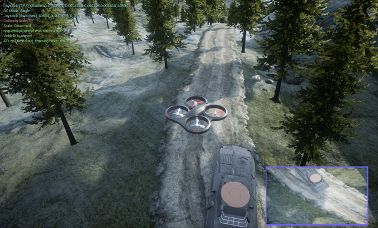

# Complete Cycle-of-Learning (CoL)

<center></center>

Cycle-of-Learning applied to teaching a quadrotor how to land on top of a landing pad based on human interaction and reinforcement learning.

## Installation

### Setup dependencies (Linux)

All dependencies will be contained in a virtual environment. A Docker option will be available in future.

Install _pip_ and _virtualenv_ to handle all Python3 dependencies:  
```sudo apt-get install python3-pip```  
```python3 -m pip install --user virtualenv```  

Create a new virtual environment:  
```python3 -m venv ~/venvs/CoL```

Clone this repo and go to its folder:  
```git clone https://github.com/viniciusguigo/complete_col.git```  
```cd complete_col```  

Activate the new environment and install dependencies:  
```source ~/venvs/CoL/bin/activate```  
```pip install wheel```  
```pip install -r requirements.txt```

### Setup dependencies (Windows)

[Visual Studio 2017](https://www.techspot.com/downloads/6278-visual-studio.html) is required to build AirSim on Windows. Install it first and select the options to install Python3.

After install Python3 together with Visual Studio 2017, install [pip and virtual environments](https://packaging.python.org/guides/installing-using-pip-and-virtual-environments/). It boils down to:
1. Install/upgrade pip: ```py -m pip install --upgrade pip --user```.
2. Install virtualenv: ```py -m pip install --user virtualenv```.

[Download and install](http://www.swig.org/download.html) _swig_, specifically _swigwin_, making sure you [add it to your PATH](https://simpletutorials.com/c/2135/Installing+SWIG+on+Windows).

Create a new virtual environment:  
```py -m venv venvs\CoL``` 

Clone this repo and go to its folder:  
```git clone https://github.com/viniciusguigo/complete_col.git```  
```cd complete_col```  

Activate the new environment and install dependencies:  
```..\venvs\CoL\Scripts\activate```  
```pip install wheel```  
```pip install setuptools --upgrade```  
```pip install -r requirements.txt```

### Setup AirSim (Linux)

Download AirSim binaries file from [this](https://drive.google.com/drive/folders/1DRHExC2ER9R7U4K7klAUDSmaPS69L6KY) Google Drive.  

Extract it and copy the address of the ```ARL_Test_Small.sh``` file to line 5 of ```run.sh``` script. Alternatively, copy the ```airsim``` file to your ```~/bin/``` folder and use the ```run.sh``` script as is.   

Copy the ```settings.json``` file to ```~/Documents/AirSim/settings.json```.   

Test the binary file by running ```./ARL_Test_Small.sh``` from its folder. The AirSim environment should start with the quadrotor landed on top of the landing pad. If you see the error "Cannot create OpenGL context. Check that the drivers and hardware support at least OpenGL 4.3 (or re-run with -opengl3)", install the latest NVIDIA drivers and make sure you see your card when you type ```nvidia-smi```.

### Setup AirSim (Windows)

Copy the ```settings.json``` file to ```Documents\AirSim\settings.json```. When following this instructions, replace ```./run.sh``` by ```.\run.ps1```.

### Setup AirSim in Virtual Reality (VR)

AirSim [works with VR natively](https://github.com/Microsoft/AirSim/issues/1426). Just download the appropriate binary (the ones ending with _VR_) and run everything as usual.

### Setup human joystick

The human can provide additional demonstrations and interventions by controlling the vehicle using a Xbox One controller. Make sure it is plugged in before starting the AirSim environment. It should also work with a Xbox 360 joystick but this has not been tested yet.

## Training

After setting up all dependencies and AirSim file, activate the virtual environment ```source ~/venvs/CoL/bin/activate``` and run ```./run.sh``` to automatically start the AirSim environment and training script. The default script loads previous 20 human trajectories, pretrain the actor and critic, and update these models using reinforcement learning. At any time, the human can intervene by pressing the LB button in the Xbox One controller and controlling the vehicle using the left and right sticks.  

Default training hyperparameters can be changed inside ```./run.sh```.

## Citation

The Cycle-of-Learning concept:  
```
@article{waytowich2018cycle,
  author={Nicholas R. Waytowich and Vinicius G. Goecks and Vernon J. Lawhern},
  title={Cycle-of-Learning for Autonomous Systems from Human Interaction},
  journal={CoRR},
  volume={abs/1808.09572},
  year={2018},
  url={http://arxiv.org/abs/1808.09572},
  archivePrefix={arXiv},
  eprint={1808.09572}
}
```

Combining in real-time demonstrations and interventions for improve task performance using fewer samples:  
```
@article{goecks2018efficiently,
  author={Vinicius G. Goecks and Gregory M. Gremillion and Vernon J. Lawhern and John Valasek and Nicholas R. Waytowich},
  title={Efficiently Combining Human Demonstrations and Interventions for Safe Training of Autonomous Systems in Real-Time},
  journal={CoRR},
  volume={abs/1810.11545},
  year={2018},
  url={http://arxiv.org/abs/1810.11545},
  archivePrefix={arXiv},
  eprint={1810.11545}
}
```

Transitioning from policies learned through demonstrations and interventions to reinforcement learning:  
```
@misc{goecks2019integrating,
    title={Integrating Behavior Cloning and Reinforcement Learning for Improved Performance in Sparse Reward Environments},
    author={Vinicius G. Goecks and Gregory M. Gremillion and Vernon J. Lawhern and John Valasek and Nicholas R. Waytowich},
    year={2019},
    eprint={1910.04281},
    archivePrefix={arXiv},
    primaryClass={cs.LG}
}
```
